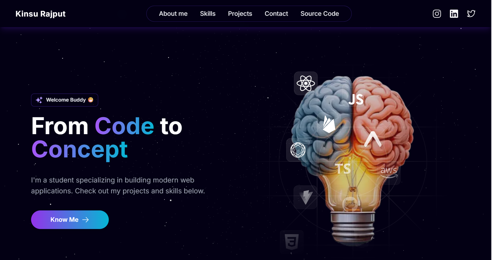
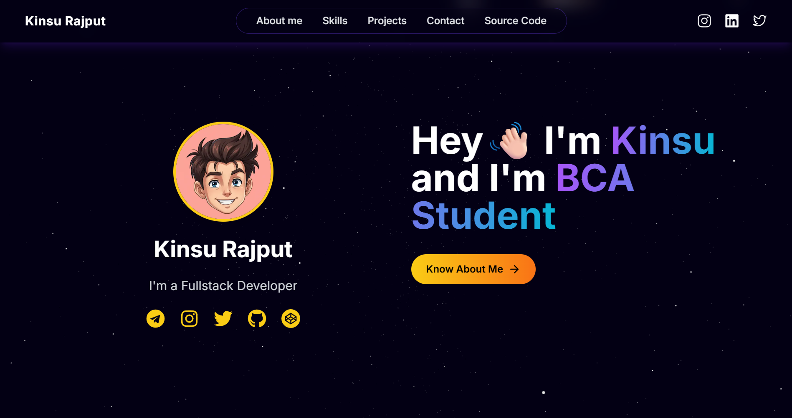
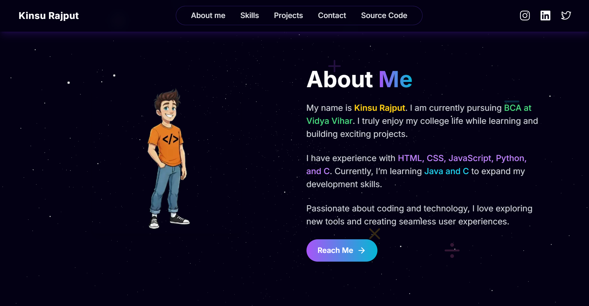
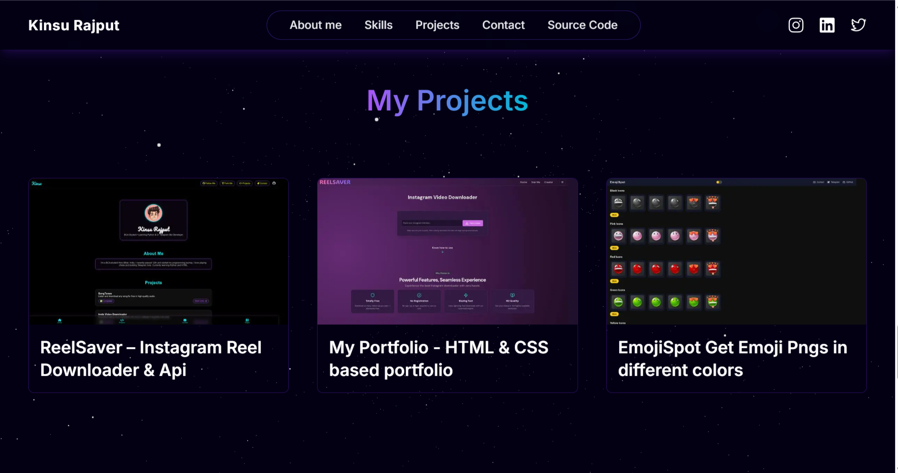
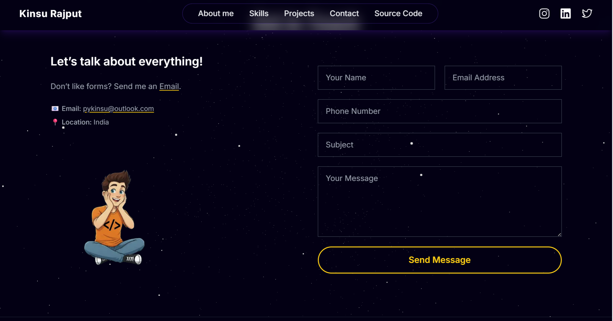

<p align="center">
  
</p>

<h1 align="center">Next.Js Portfolio</h1>

<p align="center">
  <a href="https://vercel.com" target="_blank">
    
  </a>
  <a href="https://github.com/pykinsu/nextjs-portfolio/stargazers" target="_blank">
    
  </a>
  <a href="https://github.com/pykinsu/nextjs-portfolio/network/members" target="_blank">
    
  </a>
  <a href="https://github.com/pykinsu" target="_blank">
    
  </a>
  <a href="https://kinshurajput.vercel.app/" target="_blank">
    
  </a>
</p>

<p align="center">
A clean and modern <b>Portfolio website</b> built with <b>Next.js</b>, styled using <b>TailwindCSS</b>, and deployed on <b>Vercel</b>.
</p>

---

## \:gear: Tech Stack

<p align="center">
  <a href="https://react.dev/" target="_blank"></a>
  <a href="https://nextjs.org/" target="_blank"></a>
  <a href="https://www.typescriptlang.org/" target="_blank"></a>
  <a href="https://tailwindcss.com/" target="_blank"></a>
  <a href="https://threejs.org/" target="_blank"></a>
  <a href="https://vercel.com/" target="_blank"></a>
</p>

---

## \:camera: Preview

[](https://kinsurajput.vercel.app/)

<details>
  <summary>𝗦𝗲𝗲 𝗠𝗼𝗿𝗲</summary>

[](https://kinsurajput.vercel.app/#profile)  
[](https://kinsurajput.vercel.app/#about)  
[](https://kinsurajput.vercel.app/#projects)  
[](https://kinsurajput.vercel.app/#contact)  

</details>


## ✨ Features
- ⚡ Built with **Next.js 14**
- 🎨 Styled with **TailwindCSS**
- 📱 Fully responsive design
- 🌐 Deployed on **Vercel**
- 🧩 Easy to customize & extend

---

## :toolbox: Getting Started

1. Make sure **Git** and **NodeJS** are installed.

2. Clone this repository:
   ```bash
   git clone https://github.com/pykinsu/nextjs-portfolio.git cd nextjs-portfolio ```

3. Install dependencies:

   ```bash
   npm install --legacy-peer-deps or yarn install --legacy-peer-deps
   ```

4. Run the development server:

   ```bash
   npm run dev or yarn dev
   ```

App will be available at [http://localhost:3000](http://localhost:3000) 🚀

---

## ☁️ Deployment  

Easily deploy this project on **Vercel** with just one click:  

<p align="center">
  <a href="https://vercel.com/new/clone?repository-url=https://github.com/pykinsu/nextjs-portfolio" target="_blank">
    
  </a>
</p>

---

## Project Structure

```bash
nextjs-portfolio/
│-- public/          # Assests (images, icons, etc.)
│-- src/
│   ├── app/         # Next.js App Router pages
│   ├── components/  # Reusable UI components
│   ├── lib/         # Utilities
│-- package.json
```

---

## Aᴜᴛʜᴏʀ < \ >

**Kinsu Rajput**

<p>
  <a href="https://github.com/pykinsu" target="_blank">
    
  </a>
  <a href="https://t.me/pykinsu" target="_blank">
    
  <a href="https://www.linkedin.com/in/pykinsu" target="_blank">
    
  </a>
  <a href="https://twitter.com/pykinsu" target="_blank">
  
</a>
  </a>
</p>

---

## ⭐ Sᴜᴘᴘᴏʀᴛ

If you like this project, consider giving it a ⭐ on GitHub!
